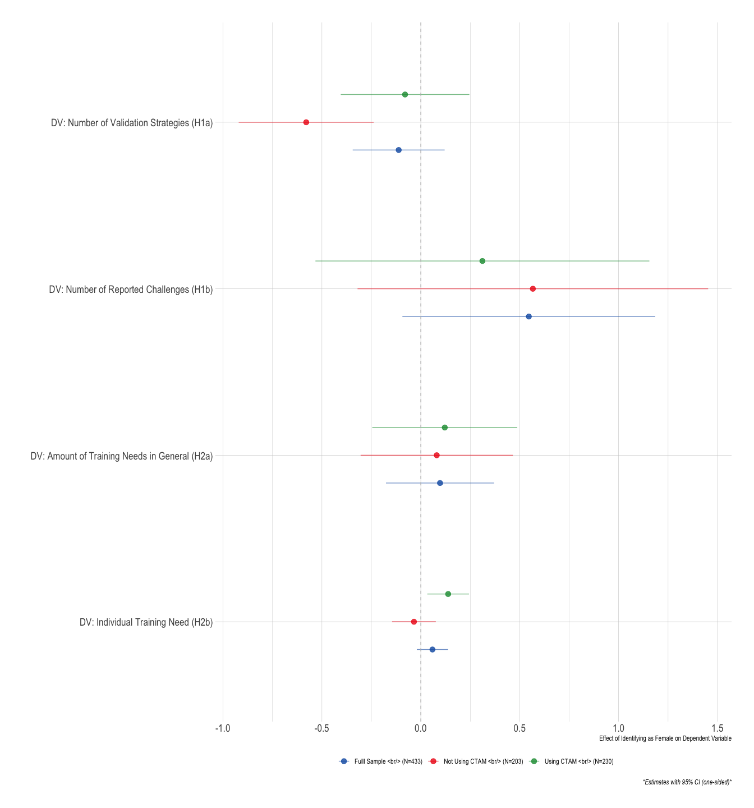
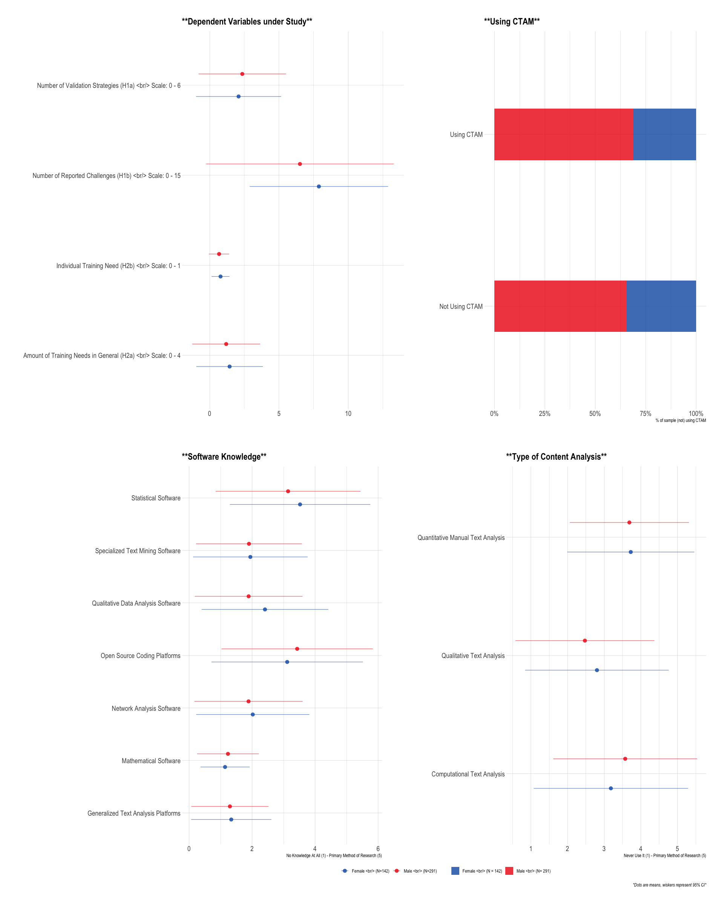
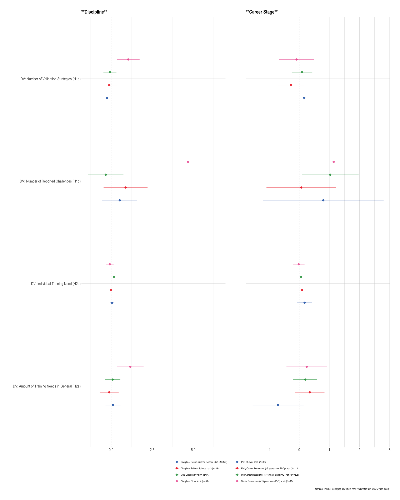

Analyses
================

# Scripts

# Required Packages & Reproducibility

``` r
rm(list=ls())
source(here::here("src/lib/functions.R"))
```

# Pre-Registered Analyses

``` r
load(here("data/intermediate/clean_data.RData"))
```

Next, we automatically extract a `.md` file for the online appendix, as
well as a latex table for the manuscript. We are using jinja2 template
[src/analysis/table_descriptives.tex.j2](table.tex.j2) which is called
with a json string containing the data. To replicate, make sure
`env/bin/pip install -U j2cli` is installed via your command line.

``` r
source(here("src/analysis/descriptive-information-overview.R"))
table2 <- knitr::kable(descr, digits=2)
fn <- here("report/figures/table_descriptives.tex")
cat("# Table: Descriptive Information of Variables under Study \n\n", file=fn)
cat(table2, file=fn, sep="\n", append=T)

methodnames <- setNames(as.list(descr$Variables), descr$Variables)
table <- purrr::map(descr, .f= ".") 
#render_j2(here("src/analysis/table_descriptives.tex.j2"), here("report/figures/table_descriptives.tex"),
#          data=list(data=table, methods=methodnames))
rm(descr, methodnames, table, fn, table2)
```

## Pre-Registered Hypotheses

``` r
source(here("src/analysis/pre-registered.R"))
p
```



``` r
kbl(df, booktabs =T, caption = "Effect of Identifying as Female for Pre-Registered Hypothesis") %>%
  kable_styling(latex_options = c("striped", "hold_position"),
                full_width = F, fixed_thead = T, position = "center") %>%
  column_spec(1, width = "10cm") %>%
  column_spec(2, width = "2cm")  %>%
  column_spec(3, width = "4cm") %>%
  column_spec(4, width = "4cm")
```

<table class="table" style="width: auto !important; margin-left: auto; margin-right: auto;">
<caption>
Effect of Identifying as Female for Pre-Registered Hypothesis
</caption>
<thead>
<tr>
<th style="text-align:left;position: sticky; top:0; background-color: #FFFFFF;">
Dependent Variable
</th>
<th style="text-align:right;position: sticky; top:0; background-color: #FFFFFF;">
Coefficient
</th>
<th style="text-align:right;position: sticky; top:0; background-color: #FFFFFF;">
CI Lower Bound
</th>
<th style="text-align:right;position: sticky; top:0; background-color: #FFFFFF;">
CI Upper Bound
</th>
</tr>
</thead>
<tbody>
<tr>
<td style="text-align:left;width: 10cm; ">
DV: Number of Validation Strategies (H1a)
</td>
<td style="text-align:right;width: 2cm; ">
-0.11
</td>
<td style="text-align:right;width: 4cm; ">
-0.34
</td>
<td style="text-align:right;width: 4cm; ">
0.12
</td>
</tr>
<tr>
<td style="text-align:left;width: 10cm; ">
DV: Number of Reported Challenges (H1b)
</td>
<td style="text-align:right;width: 2cm; ">
0.55
</td>
<td style="text-align:right;width: 4cm; ">
-0.09
</td>
<td style="text-align:right;width: 4cm; ">
1.19
</td>
</tr>
<tr>
<td style="text-align:left;width: 10cm; ">
DV: Amount of Training Needs in General (H2a)
</td>
<td style="text-align:right;width: 2cm; ">
0.10
</td>
<td style="text-align:right;width: 4cm; ">
-0.18
</td>
<td style="text-align:right;width: 4cm; ">
0.37
</td>
</tr>
<tr>
<td style="text-align:left;width: 10cm; ">
DV: Individual Training Need (H2b)
</td>
<td style="text-align:right;width: 2cm; ">
0.06
</td>
<td style="text-align:right;width: 4cm; ">
-0.02
</td>
<td style="text-align:right;width: 4cm; ">
0.14
</td>
</tr>
</tbody>
</table>

## Explorative Results

``` r
source(here("src/analysis/explorative.R"))

(descr + descr_1) / (descr_softw + descr_method) + 
  plot_layout(guides = "collect") & theme(legend.position = "bottom")
```



``` r
p_exp
```



``` r
source(here("src/analysis/explorative-types.R"))

((pv / pt + plot_layout(guides = 'auto')) | pc) +
  plot_layout(guides = "collect") & theme(legend.position = "bottom")
```


